# 설명

## 리눅스 역사

리눅스를 사용해 본지 오래 되었습니다. 1991년도 사회에 나오면서 [SunOS](https://en.wikipedia.org/wiki/SunOS)와 [HP-UX](https://en.wikipedia.org/wiki/HP-UX)와 같은 전용 워크스테이션을 접해보기도 하다가 1992년 정도에 리눅스 이전의 [산타크루즈 오퍼레이션의 SCO-OS](https://en.wikipedia.org/wiki/OpenServer)를 이용해 보기도 하였습니다. 5.25인치 디스켓을 열 몇장 설치하다가 마지막에서 삐끗 잘못되기라도 하면 몇시간 설치하던 것을 다시 하고는 하면서 약간 과장되게 며칠을 설치만 하다가 마지막에 login 프람프트라도 나오는 날이면 그 얼마나 신나했었던가 하는 최초의 기억이 남습니다. 마치 인생 첫차로 수퍼 티코를 몰면서 세상 어느 차 보다도 더 좋았던 것 같은 느낌이라고 할까요. 

그러다가 1993년 또는 1994년 정도에 [슬랙웨어](https://en.wikipedia.org/wiki/Slackware)라는 리눅스가 어느 순간 등장했습니다. 약간 더 발전을 하여 3.5인치 디스켓 십여장을 역시 유사하게 PC에 설치하고는 했었지요. 반면 92년도 정도부터 윈도우 3.x에서 프로그램을 시작했었습니다.

암튼 리눅스는 슬랙웨어 말고도  그 이후에 수없이 많은 배포본이 나왔습니다. 지금까지 가장 많이 사용되는 리눅스 계열로, [Redhat](https://en.wikipedia.org/wiki/Red_Hat)과 [Redhat Enterprise](https://en.wikipedia.org/wiki/Red_Hat_Enterprise_Linux)(이하 RHEL)를 사용하였습니다. RHEL이 인기를 끌면서 레드햇과 오픈소스 진영이 공동으로 만든 [Fedora](https://ko.wikipedia.org/wiki/페도라_(운영_체제))가 나와서 이용해 보았습니다. [CentOS](https://ko.wikipedia.org/wiki/CentOS)는 RHEL과 완벽하게 호환되는 무료 기업용으로 만든 것인데 현재의 리눅스 메인 배포본이라 할 수 있습니다. RPM이라는 패키징 메니저를 이용하여 패키징 관리를 하고 yum 이라는 것으로 패키지 업그레이드 및 원격 설치 등을 할 수 있는 특징이 있지요. 헌데 2006년에 어떤 사고로 인하여 저는 이 패키지를 특별한 이유가 있지 않으면 사용하지 않습니다. 그 이유는 RHEL을 이용하여 중요한 프로젝트를 진행하고 있었고 중간 발표가 있던날 새벽에 발생한 침해사고 때문이었습니다. 악의를 가진 해커가 RHEL에 디폴트로 설치되는 많은 서비스 중에 하나를 [사전 공격](https://en.wikipedia.org/wiki/Dictionary_attack)에 의해 계정을 탈취했고 root 권한을 얻었으며 시스템을 마비시키는 침해 사고를 당한 경험이 있었습니다. 그 때 이후로 위의 빨간모자 계열은 사용하지 않게 되었습니다. 

그리다가 다른 배포판으로 찾았던 것이 [gentoo 리눅스](https://ko.wikipedia.org/wiki/젠투_리눅스) 였습니다. 다른 배포판과 달리 가장 특별한 것은 emerge라는 패키징 툴을 이용하여 설치하는 것 까지는 다른 배포판과 유사하나 이 설치가 누군가가 build 해 놓은 것이 아닌 모든 것이 소스에서부터 build하는 특성을 가집니다. 따라서 데스크탑 환경을 구축하려 한다면 밤새도록 컴파일하고 build 시켜 동작하게 되어 있습니다. 그러면 왜 이런 배포판을 사용할까요? 그 이유는 젠투 리눅스를 이용하면, 임베디드 리눅스를 비롯하여 거의 모든 하드웨어에 맞춤 최적화 개인화된 리눅스를 만들 수 있습니다. 실제 새로운 장비나 장치가 다른 배포판의 리눅스가 설치되기 어려운 상황에서 젠투 리눅스를 시도하면 성공했던 경험이 있습니다.

다음으로 레드햇과 더불어 큰 획을 그은 배포판은 [debian](https://ko.wikipedia.org/wiki/데비안) 입니다. 데비안은 다른 일반적인 리눅스 배포판에 비하여 가볍고 설치도 빠르고 필요한 서비스만 띄우는 특성을 가집니다. 이 데비안 배포판에 기초하여 그 위에 또 다른 배포판이 나오기도 합니다. 아마도 2007년 이후부터는 어떤 리눅스 배포판이 좋을까 찾았었는데 2008년 이후로 지금까지 메인 리눅스 배포판으로 이용하고 있는 것이 바로 [우분투](https://ko.wikipedia.org/wiki/우분투_(운영_체제)) 리눅스 입니다. 데비안과 동일하게 apt (또는 apt-get) 이라는 aptitude 패키징 툴을 이용하여 패키지 업데이트 및 업그레이드 등을 할 수 있습니다.

우분투는 해마다 두가지 버전으로 배포됩니다. 해당 년도에서 2000을 뺀 것이 메인 버전이고 4월과 10월에 나오는 배포판이 있습니다. 올해는 17.04가 가장 최신 버전이고 17.10 이 10월에 배포될 예정입니다. 이 중에서 특별히 짝수년 4월에 배포되는 버전은 [LTS (Long Term Service)](https://wiki.ubuntu.com/LTS) 라고 하여 하드웨어 포함 업그레이드 지원은 출시 후 2년까지 다시 패키지 업그레이드 지원은 출시 후 4년까지 지원합니다. 하지만 특별히 12.04 LTS 버전인 경우 출시 후 6년까지 보안 업그레이드를 지원합니다. ([버전 별 LTS 버전 지원 확인](https://www.ubuntu.com/info/release-end-of-life))

[윈도우 서버를 제외하고 IDC에서 가장 많이 사용되는 리눅스 배포판](http://www.makeuseof.com/tag/best-linux-server-operating-systems/)에서 확인할 수 있듯이 우분투 데비안 레드헷 OpenSUSE 등이 있음을 알 수 있습니다.

## 우분투 서버 : 데스크탑

우분투는 크게 두 가지 버전으로 나뉘어 집니다. 우분투 서버와 우분투 데스크탑 입니다. 서버는 UI가 없는 것으로 BackEnd 개발을 위해 최적화 되어 있습니다. 데스크탑 버전은 오피스 등을 포함하여 UI 환경을 갖춘 윈도우를 대체하여 사용할 만한 목적입니다. 

### 우분투 데스크탑

우분투 데스크탑에 대해서 조금 더 살펴보자면  X-Window 라는 기본 화면 구성 하위 기반이 있고 그 위에 윈도우 매니저에 따라 여러가지가 있습니다.

* [gnome](https://ko.wikipedia.org/wiki/그놈) : 11.04 데스크탑 까지는 그놈 윈도우 매니저를 이용하였으나 그 이후 Unity 라는 캐노니컬 만의 윈도우 매니저를 사용하게 됩니다. 반면 CentOS는 계속 그놈을 사용하고 있는 것으로 보입니다. (틀리면 지적해 주십시오)
* [KDE](https://ko.wikipedia.org/wiki/KDE) : 그놈과 더불어 X-Window 진영에서 양대 윈도우 매니저입니다. 특별히 KDE로 꾸며놓은 배포판은 [Kubuntu](http://www.kubuntu.org) 라고 하여 이용할 수 있습니다.
* [Unity](https://en.wikipedia.org/wiki/Unity_(user_interface)) : 캐노니컬사에서 야심차게 별도의 데스크탑으로 큰 꿈을 품고 적용을 하였으나 결국은 18.04 데스크탑부터는 그놈으로 되돌아 간다 합니다. 개인적으로는 Unity를 처음 이용하고는 버그도 많고 너무 무거워서 우분투 데스크탑을 사용하지 않게 되었습니다.
* [Xfce](https://ko.wikipedia.org/wiki/Xfce) : 가벼운 윈도우를 기치로 꾸준히 사용되어온 윈도우 매니저 중에 하나입니다. Kubuntu 처럼 [xubuntu](https://xubuntu.org)라는 배포판을 관리하고 있습니다.
* [LXDE](https://en.wikipedia.org/wiki/LXDE) : 개인적으로는 제일 좋아하는 윈도우 매니저 입니다. 역시 xubuntu 처럼 [lubuntu](http://lubuntu.net) 라는 별도 배포판이 존재합니다.

결론적으로 여러가지 이유 때문에 데스크탑 OS로는 윈도우 또는 맥을 이용합니다. 2009년 이전에는 윈도우를 데스크탑으로 이용하다가  그 이후에는 맥을 이용해 왔던 것 같습니다. 그에 반하여 우분투 데스크탑을 메인 OS로 설치하여 이용하지 않았던 것 같습니다.

결국 리눅스는 개발 시 주로 백엔드 작업이나 웹 확인 등을 위한 가상머신으로 동작시키는 등으로 이용하게 되었습니다.

### 우분투 서버

우분투 서버는 데비안 처럼 무척 설치하기 좋고 짝수년 4월 나온 서버 버전은 특별히 LTS (Long Term Service) 라 하여 적어도 4년의 유지보수를 보장해 줍니다. 특히 위의 데스크탑을 설명하면서 결론적으로 이야기 했던 것처럼 맥이나 윈도우에서 개발을 위하여 가상머신으로 리눅스를 동작시켰습니다.

우분투 서버는 LTS 버전을 주로 이용하기 때문에 2년 마다 적용해 보고는 합니다. 가장 마지막 LTS 버전은 16.04 이고 다음 것은 18.04 가 될 것입니다.

이제 우분투 서버를 가상머신으로 만들면서 어떤 요구사항이 생겼는데 바로, 가장 작은 이미지를 유지하는 것이었습니다.

그렇게 살펴본 것은 [JEOS](https://en.wikipedia.org/wiki/Just_enough_operating_system) 라는 것이었습니다. 쥬스라고 발음 되는데 가상 머신 등에서와 같이 설치할 때 가장 최소화된 것으로 동작될 수 있도록 만들어 놓은 것입니다.

우분투 서버도 JEOS 설치가 가능한데 아마도 12.04 이후로는 처음 설치할 때 선택 가능합니다. 예를 들어 우분투 16.04 서버를 설치하면서,

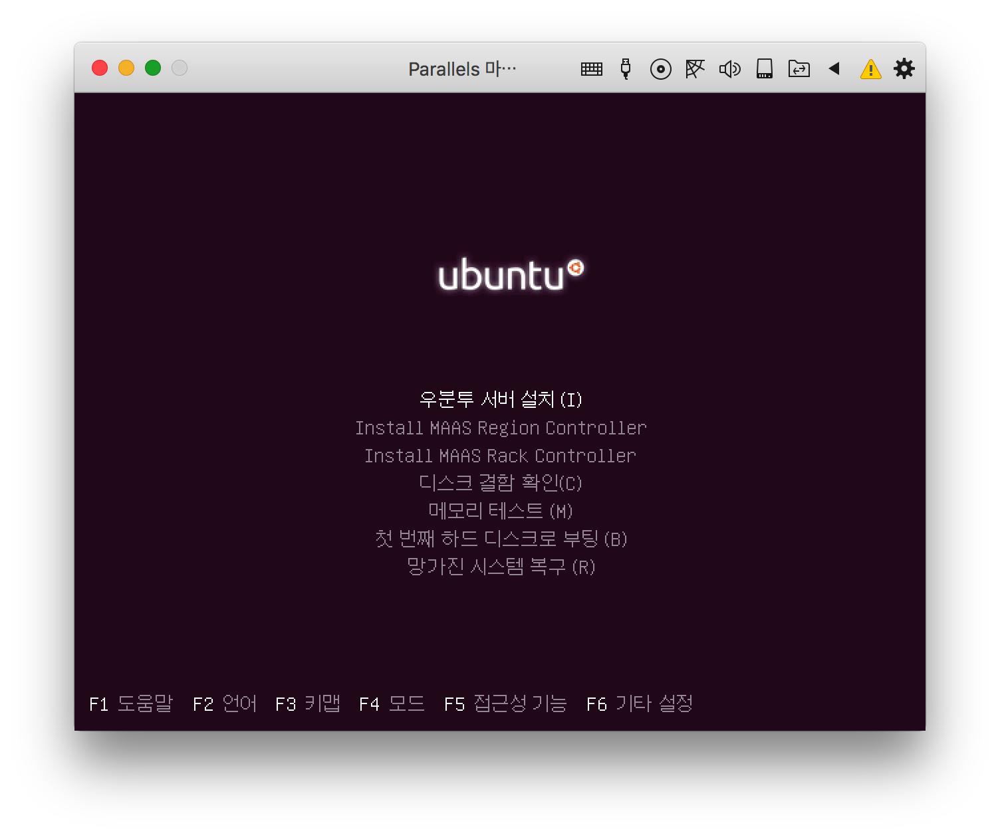 
F4를 누르면 `모드` 변경을 할 수 있으며,

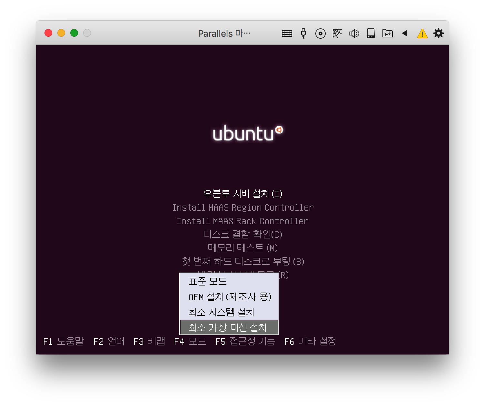 
위와 같이 최소 가상 머신 설치가 바로 JEOS 버전을 설치하는 것입니다.

> 참고 : 가상머신 뿐만 아니라 docker 에서도 최소화된 리눅스는 이미지 크기를 줄일 수 있는 중요 이슈이며 최근에는 alpine 리눅스라 하여 이 버전의 리눅스를 docker 컨테이너로 돌려보면 3.5MB 로 리눅스 박스가 도는 것을 확인할 수 있습니다. ([docker alpine linux 참조](https://hub.docker.com/_/alpine/), 말 그대로 최소화된 리눅스 박스가 돌며 필요한 것들은 그때 그때 생성해 주어야 합니다)

가상머신에 이 `최소 가상 머신 (JEOS)` 버전을 설치하고 이를 기반으로 개발에 필요한 패키지를 apt로 설치하면서 설치부터 스크립트를 별도 만들어 나가고는 합니다.

# VBuntu

## 기본

위에서처럼 기본 데스크탑 말고 우분투 서버 (그것도 가능하면 JEOS 버전)으로 작업을 진행하다 보면 윈도우 환경이 필요하기도 하고 해당 서버에 원격데스크탑으로 접속해서 사용해 보고 싶기도 합니다. 이런 목적에서 다음과 같은 블로그에서 해당 내용을 정리해 보기도 하였습니다.

* [[Ubuntu 12.04/14.04] 가벼운 LXDE 환경](http://mcchae.egloos.com/10991779)
* [[Ubuntu 16.04] 가벼운 LXDE 환경](http://mcchae.egloos.com/11214796)
* [[우분투12.04서버] 가벼운 GUI 개발 환경 갖추기 <1>](http://mcchae.egloos.com/10935938)
* [[우분투12.04서버] 가벼운 GUI 개발 환경 갖추기 <2>](http://mcchae.egloos.com/10935947)
* [[Debian 6.0.6 + LXDE] 가벼운 리눅스 데스크탑 환경](http://mcchae.egloos.com/10989507)

위와 같은 정리를 하다보니 특히 우분투 서버 최소 가상화 버전부터 시작하여 그 위에 최소한의 LXDE 환경을 구축하고 원격데스크탑을 이용하기 위한 [xrdp](http://www.xrdp.org) 패키지를 설치하고 이용해 보았습니다. 그러다가 필요한 환경을 다음과 같이 수정해 나갔지요.

* [[LXDE] X 윈도우 매니저 환경 설정](http://mcchae.egloos.com/10989994)
* [[Ubuntu] LXDE 데스크탑 환경에서 자동 배경화면 바꾸기](http://mcchae.egloos.com/11088455)
* [[LXDE] LXDM 로그인 화면설정 및 LXDE 자동 실행 (zenity dialog)](http://mcchae.egloos.com/11177095)
* [[OS X, Ubuntu] 터미널에서 tmux 사용해 보기](http://mcchae.egloos.com/11246020)

결론은 6년 정도 이렇게 작업을 하다보니 별도의 lubuntu와 유사하게 커스텀 ISO 이미지를 만들게 되었습니다.
([[우분투] 12.04 커스텀 ISO 서버 이미지 만들어 보기](http://mcchae.egloos.com/11145086) 참조)

lubuntu와 유사하다고 생각할 수도 있지만 다음과 같은 차이가 있다 생각합니다.

* 설치에 최초 "한글" 선택만 제외하고는 모두 자동으로 설치되도록 하였습니다. (자신에 맞는 커스텀은 별도 해당 소스 프로젝트에서 해 보실 수 있습니다.)
* 데스크탑이 목적이 아니기 때문에 설치될 떄 오피스, 메일 등의 기타 앱은 거의 없습니다. 대신 웹브라우저는 있습니다. 심지어 네트워크 설정 UI 등 설정 관련된 것도 거의 없습니다. 이 이유는 우분투 서버를 관리하는 것이 목적이었기 때문에 대부분 터미널 CLI 명령어로 처리한다고 보았습니다.
* 다시 강조하면 우분투 서버 인데 개발에 필요한 에디터 (sublime text 등) 및 IDE (PyCharm, Eclipse 등)를 설치하여 개발할 수 있도록 하였습니다.

Vbuntu 라 이름 지은 이유는 가상화를 위한 것을 의미하였지만 실제 서버에 설치해도 무리 없을 것입니다.

현재는 다음과 같은 세 가지 버전이 존재합니다.

* [VbuntuServer-12.04.5-amd64.iso](https://drive.google.com/open?id=0ByDuZ7fltXXhSUhENFI4eHpBZjQ) : 우분투 서버 12.04.5 64bit 버전을 기반으로 만들어 놓은 것입니다.
* [VbuntuServer-14.04.5-amd64.iso](https://drive.google.com/open?id=0ByDuZ7fltXXhYVNPRXdIVDByNWc) : 우분투 서버 14.04.5 64bit 버전을 기반으로 만들어 놓은 것입니다.
* [VbuntuServer-16.04-amd64.iso](https://drive.google.com/open?id=0ByDuZ7fltXXhVDlpVldjbW05dkk) : 우분투 서버 16.04 64bit 버전을 기반으로 만들어 놓은 것입니다.
 
 
## 설치

### 맥에서 패러랠즈로 설치 
 
 다음과 같이 설치하면 됩니다.
 
 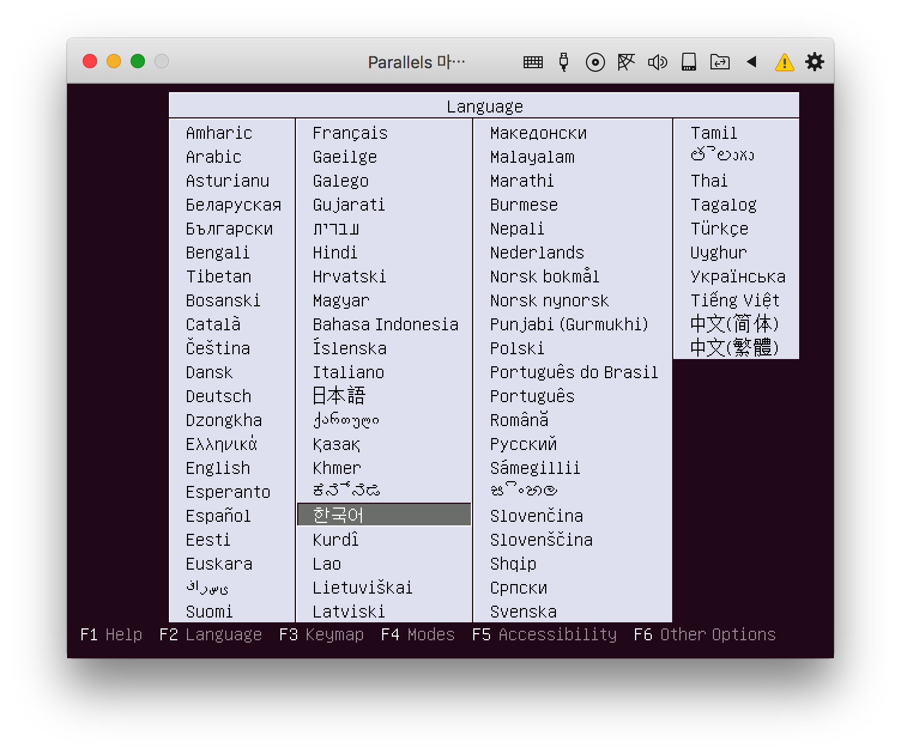
 CD로 설치를 시작하면 위와 같이 나오는 곳에서 `한국어`를 선택합니다.
 
 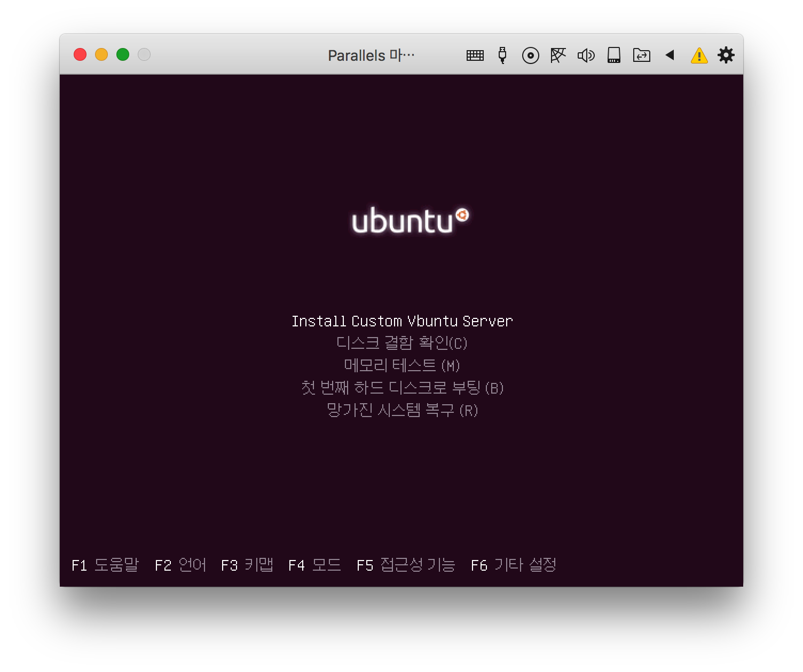
 제일 상단에 선택되어 있는 `Install Custom Vbuntu Server`가 선택되어 있는 상태에서 엔터를 누릅니다.
 그 이후 모든 것은 자동으로 넘어갑니다. (DHCP로 자동 IP주소를 받아오도록 되어 있는데 만약 네트워크에 연결되어 있지 않거나 DHCP 서버가 있지 않다면 네트워크 오류로 인한 오류가 발생할 수 있지만 SKIP 하고 넘어가면 됩니다)
 
 약 십여분 정도 (제 레티나 맥북프로 2014 에서 패러렐즈로 돌려보면 약 5분 정도 소요되었습니다) 설치를 마치면 다음과 같이 reboot 됩니다.
 
 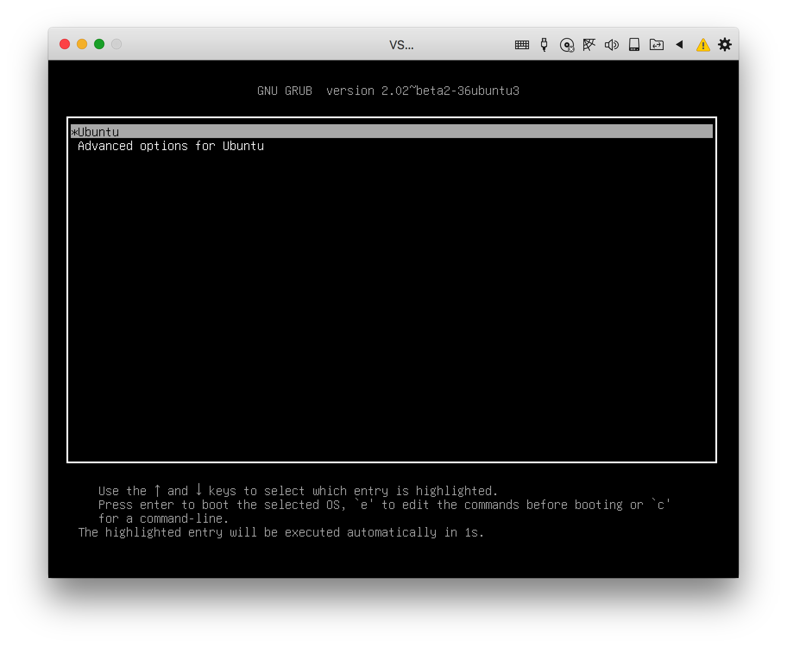
 그냥 기다리면 몇 초 후에 다음으로 넘어갑니다.
 
 
 그러면 위와 같이 로그인 화면이 나타납니다.
 
 `toor` 사용자 밖에 없습니다. 선택합니다. (만약 수정하시려면 build 소스에서 수정하시기를)
 `toor` 사용자를 디폴트로 준 이유는 예전 가상화 머신을 우분투나 데비안에서 배포하면서 디폴트 사용자로 root를 뒤집은 toor를 많이 사용하였기 떄문입니다.
 
 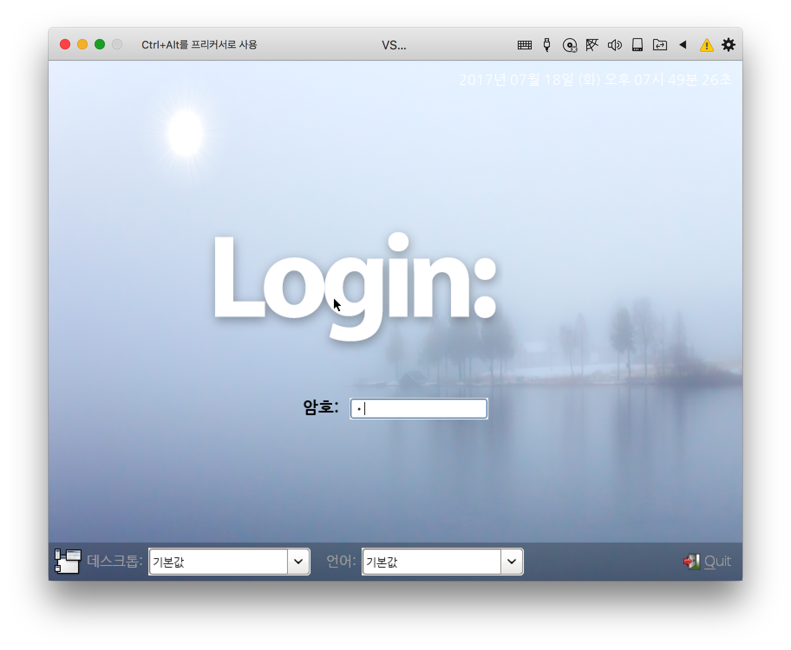
 암호는 디폴트로 `r`로 넣어주었습니다.
 
 혹시 서비스를 목적으로 설치하셨다면 **꼭!!!** 암호를 변경하시기 바랍니다.
 
 
#### Parallels 가상화 툴 설치
 
 가상화를 돌리려면 VMWare가 가장 유명합니다만 오라클의 VirtualBox도 있고 맥에서는 Parallels 라는 것도 있습니다. 저는 맥에서 패러렐즈를 주로 이용합니다. 위와 같은 가상화 환경에서 설치를 마친 다음에는 모든 가상화에서는 개별 툴을 설치하여 해당 가상머신이 최대한의 성능을 내도록 하고 있습니다.
 
 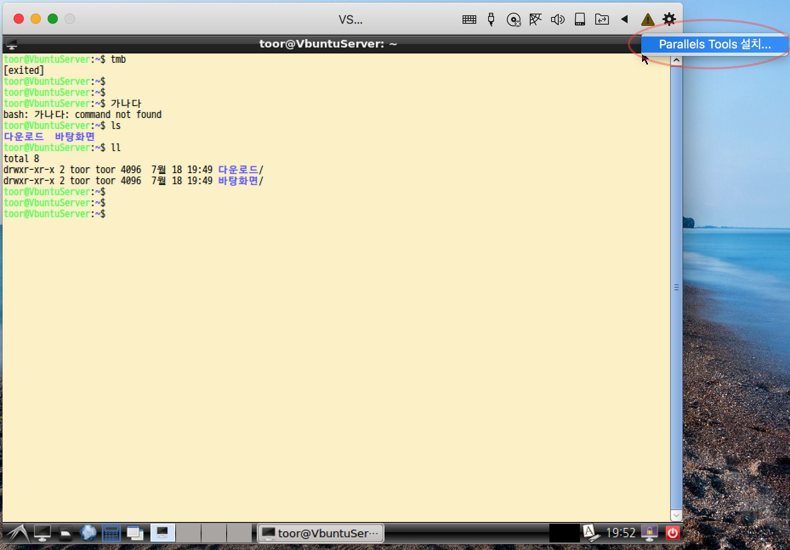
 `Paralles Tools 설치...`를 선택하고,
 
 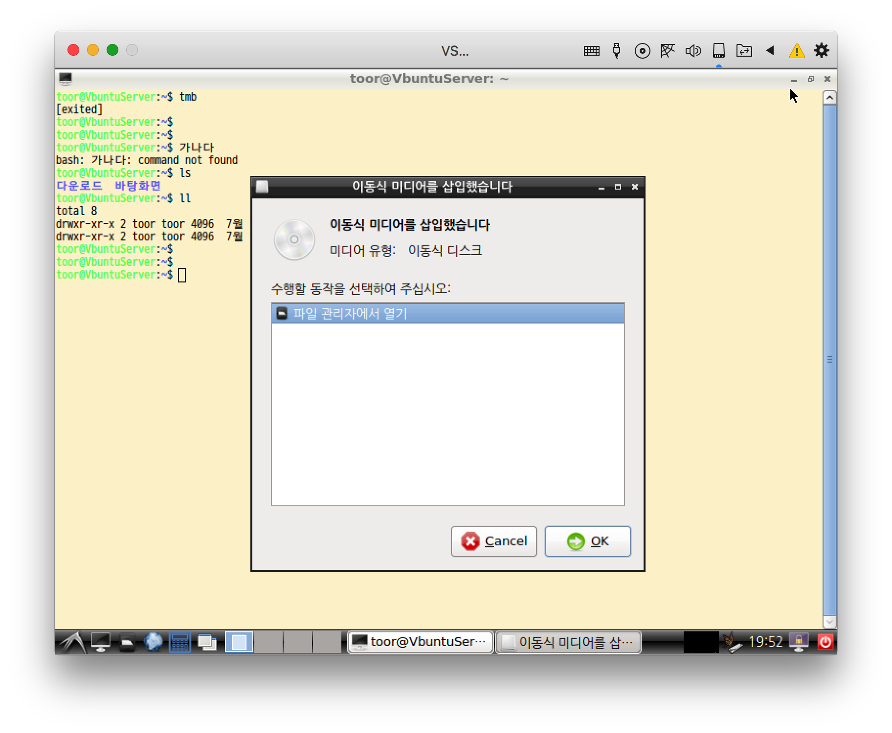
 해당 미디어를 위와 같이 등록합니다.
 
 해당 CDROM이 경우에 따라 자동으로 mount 되지 않는 경우도 있는데 그런 경우에는,
 
 ```sh
 $ sudo mount /dev/cdrom /media/cdrom
 ```
 
 과 같이 별도 cdrom을 mount 시킵니다.
 
 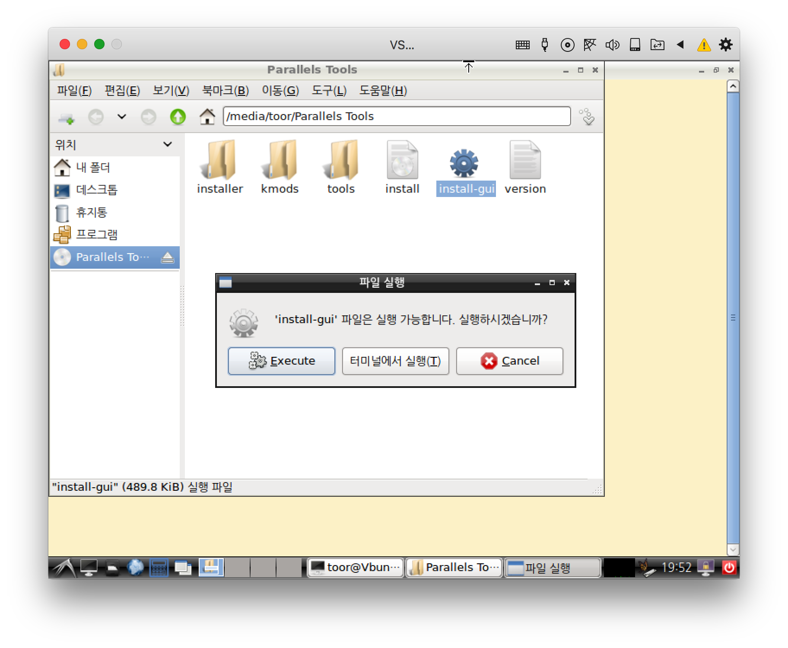
해당 폴더로 들어가 `install-gui`를 실행하고 `Execute` 단추를 누르고 `toor` 암호를 넣어 설치를 해 줍니다.

### 윈도우 (7, 10) 에서 VirtualBox로 설치

윈도우 10 서피스에서 최신 버전의 [VirtualBox (5.1.24)](https://www.virtualbox.org/wiki/Downloads) 를 설치하고 해당 [`VirtualBox 5.1.24 Oracle VM VirtualBox Extension Pack` ](http://download.virtualbox.org/virtualbox/5.1.24/Oracle_VM_VirtualBox_Extension_Pack-5.1.24-117012.vbox-extpack) 까지 설치를 한 다음 가상머신을 만들어 실행시켰더니,


위와 같은 오류가 발생했습니다.

만약 위와 같은 오류가 발생한다면 다음과 같이,

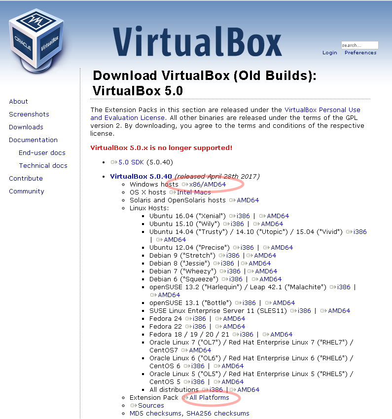

VirtualBox 5.0.40을 깨끗하게 설치합니다. (Windows 7, 10 에서 기본 우분투도 설치 안되던 것이 설치되었습니다)

최초 가상머신의 CD에 [VbuntuServer-16.04-amd64.iso](VbuntuServer-16.04-amd64.iso) 이미지를 연결시켜 실행시킵니다.

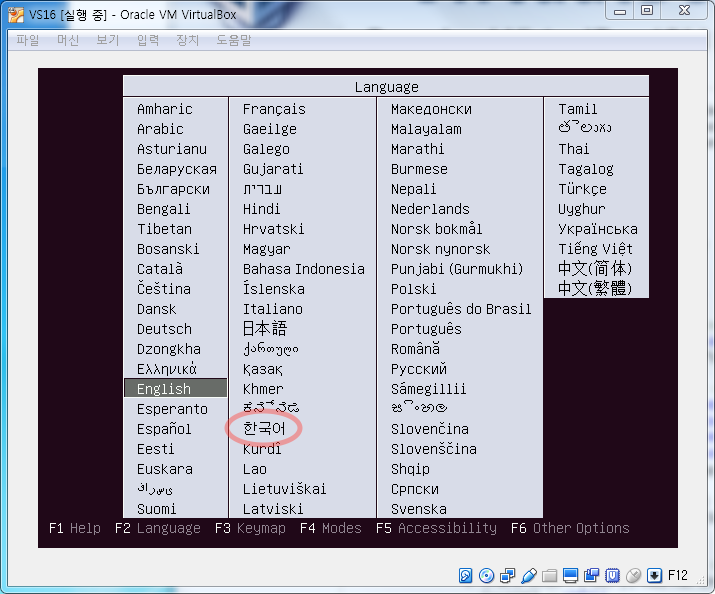

한국어를 선택하고 엔터를 누른 다음, `Install Custom Vbuntu Server`를 선택하면 자동 설치가 됩니다. 저사양의 윈도우에서 돌려보니 대략 20여분 소요되었던 것 같습니다.

로그인은 `toor` 사용자와 암호는 `r` 이 기본으로 설정되어 있습니다.

#### VirtualBox 게스트 확장 설치

패러렐즈와 마찬가지로 게스트 확장을 설치 합니다.

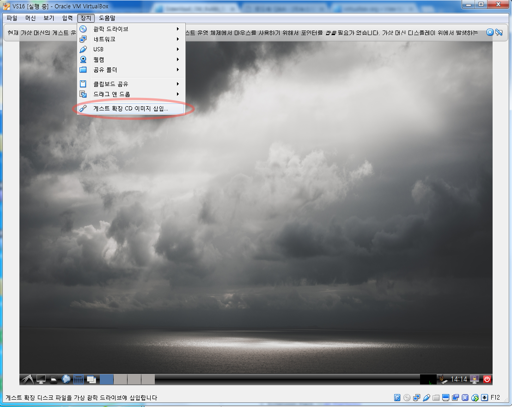

위와 같이 `게스트 확장 CD 이미지 삽입...`을 선택하고,

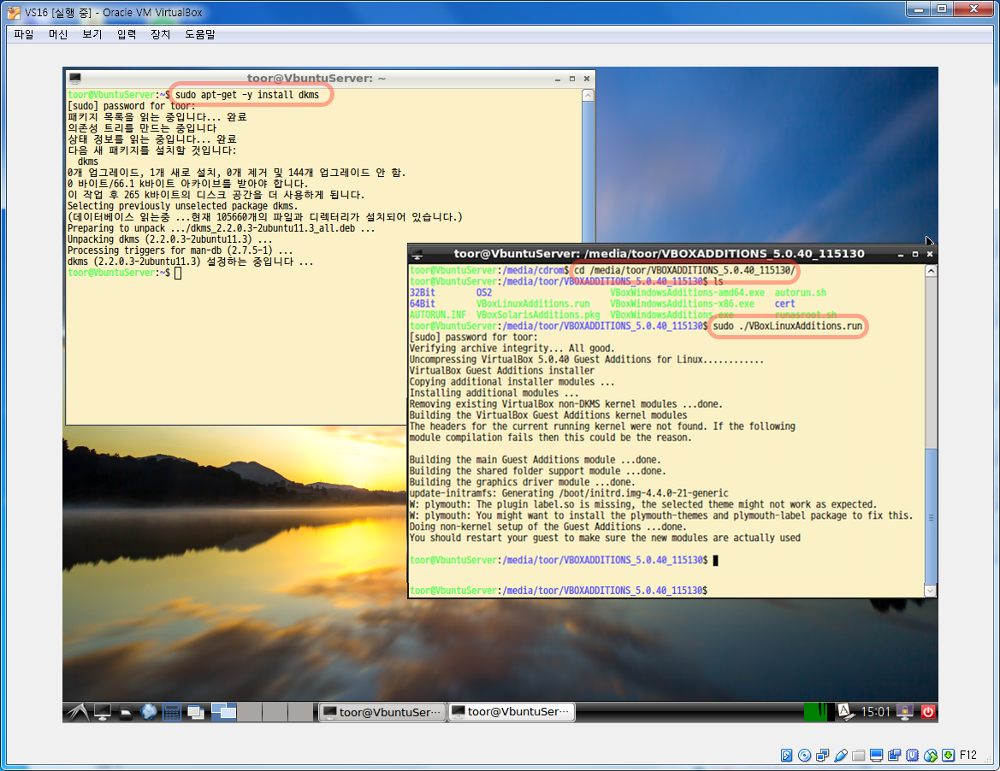

위에서 처럼 터미널에서 (좌하에 디스플레이 같이 생긴 아이콘 실행) 다음의 명령을 순서대로 입력합니다.
(위의 예에서는 터미널 창을 두개 열었지만 하나로 순서대로 입력해도 됩니다)

``` sh
$ sudo apt-get -y install dkms
$ cd /media/toor/VBOXADDTIONS_5.0.40_115130/
$ sudo ./VBoxLinuxAddtions.run
$ sudo shutdown -r now
```

한가지 문제는 메뉴에 보기에서 `게스트 디스플레이 크기 자동 조절`을 선택된 상태로 놓고 창의 크기를 조절하였는데 바로 반영되는 것이 아니라 아주 작아진 상태로 바뀌로, 이 상태에서 다시 변경했던 크기로 가져다 놓아야 크기 조절이 된 것처럼 보인다는 것이었습니다. (해결책을 찾으신 분은 별도 알려주시기 바랍니다. [이메일 보내기](mailto:mcchae@gmail.com))

## ToDo

우분투 서버 16.04.2 최신 버전에서 커스텀 ISO를 build 하려고 하였으나 실패하였습니다.
나중에 18.04가 나오면 다시 추가하여 작성해 볼 예정입니다.

## 사용법

> TODO : 별도 강의를 하거나 주제에 맞게 사용법을 정리해 볼 생각입니다.

# 결론

그동안 30년이 가까와 오도록 개발 및 환경 구축을 하고 등등의 세월이 지나갔습니다. 어려웠던 고등학교 시절 학교에서 축제를 하였고 우연히 접해본 컴퓨터에서 BASIC으로 LET 명령으로 변수를 할당하면서 1부터 100까지 FOR LOOP를 돌리며 결과가 나오는 순간 컴퓨터를 60살까지 하겠다고 결심했습니다만 지금 보면 60살이 아니라 70살까지 계속 해야 할 듯 합니다. 

수없이 새롭게 나오면서 발전하는 하드웨어 뿐만 아니라 프로그래밍 언어, 프레임워크, 새로운 기술 등등... 정말로 다 따라가려면 정신이 한개도 없지만 그럼에도 30년 가까이 경험을 하다보니 그런 눈은 생기는 것 같습니다. 어느 기술은 예전 기술을 개선한 것이요, 어느 프로그래밍 언어는 어느 언어와 어느 언어의 장점을 따서 만든 것이라는 등 말이지요.

암튼 앞으로 수십년이 지나도록 리눅스가 백엔드 서비스로 없어질 것 같지는 않습니다. 또한 그곳에서 개발해야 하는 상황도 당분간 변함이 없겠지요.

그런 환경에 맞추어 자신의 데스크탑 및 노트북에서 해당 리눅스 개발을 해 봐야하는데 개인적으로 느끼기에 너무 모르고 있는 현실인 것 같습니다. 그런 분들에게 접근할 수 있는 단초가 되었으면 하는 바램입니다...

어느 누군가에는 도움이 되시기를...

vbuntu-custom-ubuntu-iso
iso images for Lightmost Ubuntu desktop from Server using LXDE in Korean Environment.
